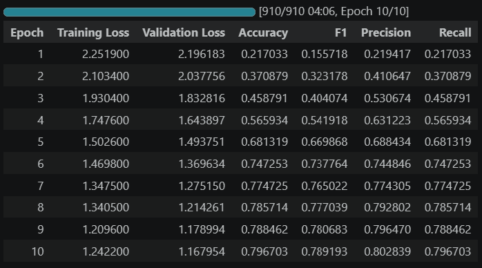
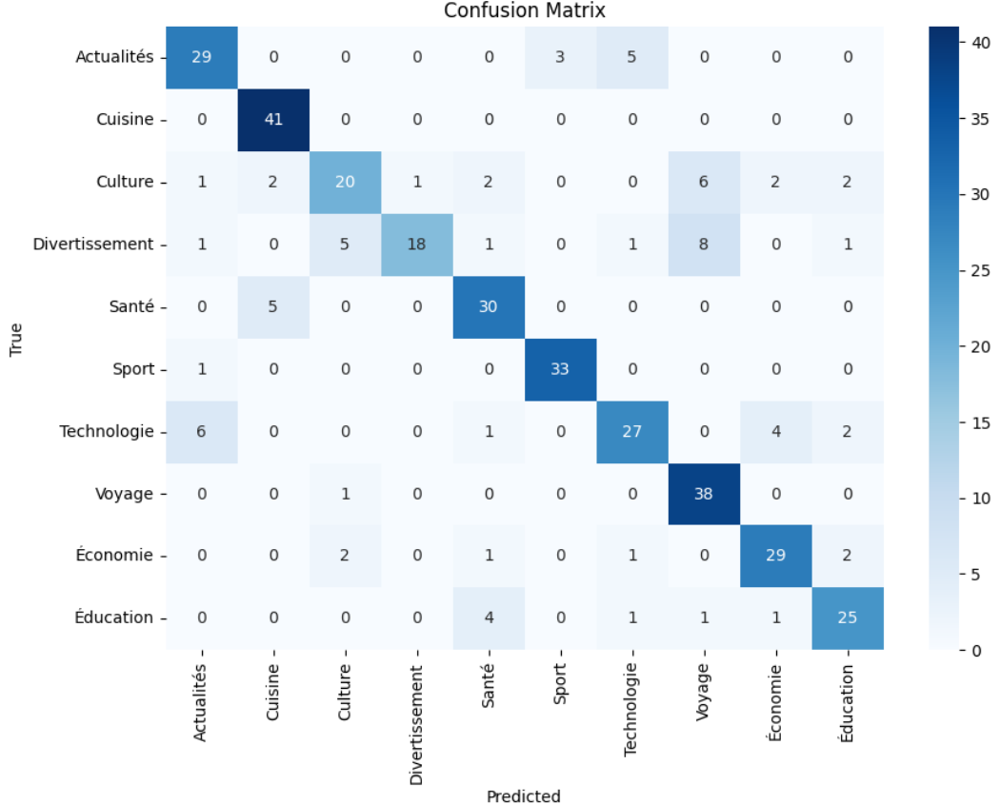

<div align="center">

# 🚀 Fine-Tuning DarijaBERT for Moroccan Darija Text Classification

### 🧠 Parameter-Efficient NLP Fine-Tuning using LoRA & Hugging Face Transformers

<p align="center">
  
  
  
  
  
</p>

</div>

---

# 📌 Overview

This project focuses on fine-tuning the **SI2M-Lab/DarijaBERT** model for **Moroccan Darija text classification** using **LoRA (Low-Rank Adaptation)**.

The workflow demonstrates a complete modern NLP pipeline including:

✅ Data preprocessing  
✅ Tokenization  
✅ LoRA fine-tuning  
✅ Model evaluation  
✅ Metrics visualization  
✅ Confusion matrix analysis  

The objective is to build an efficient NLP model capable of understanding and classifying Moroccan Darija text.

---

# 🧰 Tech Stack

| Category | Technologies |
|---|---|
| Programming | Python |
| Deep Learning | PyTorch |
| NLP | Hugging Face Transformers |
| Fine-Tuning | LoRA / PEFT |
| Data Processing | Pandas, NumPy |
| Evaluation | Scikit-learn |
| Visualization | Matplotlib |
| Environment | Jupyter Notebook |

---

# 📂 Project Structure

```bash
darijabert-lora-finetuning/
│
├── data/
│   └── dataset_darija2.csv
│
├── notebooks/
│   └── darijabert_finetuning.ipynb
│
├── results/
│   ├── confusion_matrix.png
│   └── training_metrics.png
│
├── README.md
├── requirements.txt
└── .gitignore
```

---

# ⚙️ Workflow

<div align="center">

```text
Dataset → Preprocessing → Tokenization → DarijaBERT → LoRA Fine-Tuning → Evaluation → Visualization
```

</div>

---

# 📊 Training Results

<div align="center">

| Metric | Score |
|---|---|
| 🎯 Accuracy | 79.67% |
| 🧠 F1-Score | 78.91% |
| 📌 Precision | 80.28% |
| 🔍 Recall | 79.67% |

</div>

---

# 📈 Results Visualization

## 🔥 Training Metrics

<p align="center">
  
</p>

---

## 🧩 Confusion Matrix

<p align="center">
  
</p>

---

# 🚀 Installation

Clone the repository:

```bash
git clone https://github.com/Souadzriouil/darijabert-lora-finetuning.git
cd darijabert-lora-finetuning
```

Install dependencies:

```bash
pip install -r requirements.txt
```

---

# ▶️ Run the Project

Launch Jupyter Notebook:

```bash
jupyter notebook
```

Open:

```bash
notebooks/darijabert_finetuning.ipynb
```

---

# 📦 Requirements

```txt
transformers
torch
peft
datasets
accelerate
huggingface_hub
scikit-learn
pandas
numpy
matplotlib
jupyter
notebook
ipywidgets
```

---

# 🔮 Future Improvements

- Hyperparameter optimization
- Larger Moroccan Darija datasets
- Streamlit deployment
- Real-time inference API
- Model optimization for production

---

# 👩‍💻 Author

<div align="center">

## Souad Zriouil

### AI Engineer | Data Scientist | NLP & LLM Enthusiast

<p align="center">
  <a href="https://github.com/Souadzriouil">
    
  </a>

  <a href="https://www.linkedin.com/in/souad-zriouil-54b19b267">
    
  </a>
</p>

</div>

---

<div align="center">

⭐ If you like this project, feel free to star the repository.

</div>
